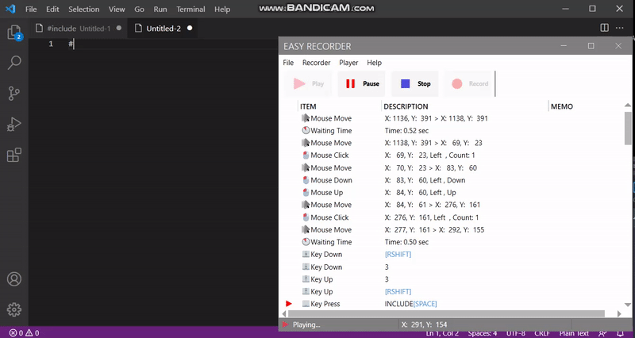

# Easy Recorder 

## Easy to use a recorder for Keyboard & Mouse

 - Coding Demo

## Supported Major Functions

 - Can Record `Keyboard & Mouse` Input

    - Keyboard Up & Down

    - Keyboard Press

    - Mouse Move

    - Mouse Click

    - Mouse Up & Down

    - Mouse Wheel Move

  - Modify Recorded Items

  - Support Memo for Items

  - Can Save & Load a ESR file

  - Support Toast Message

  - Support a Log Window (for Debugging)

